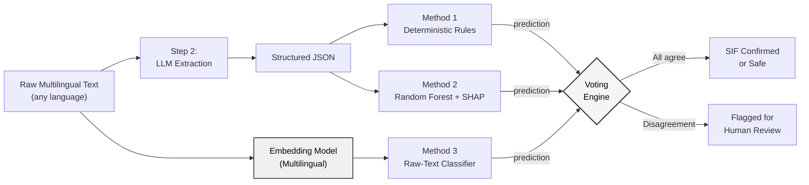
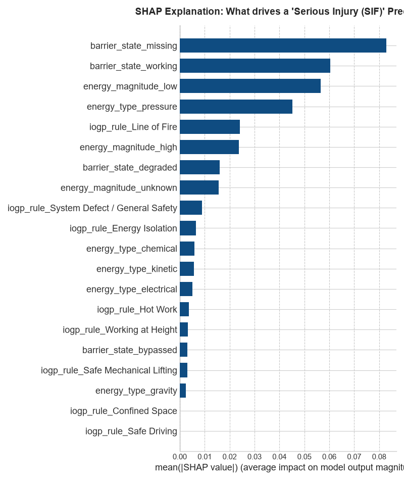
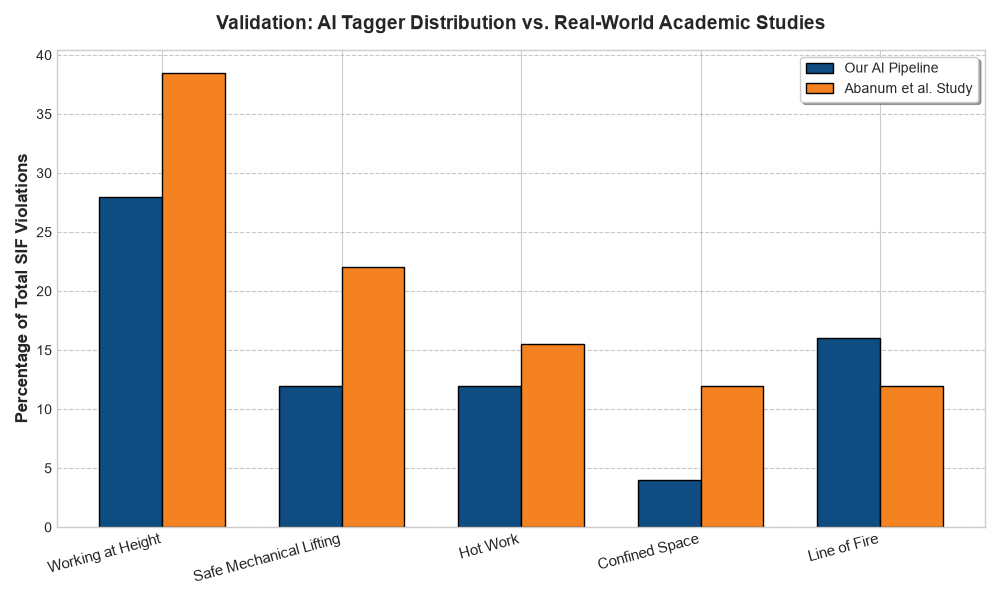

# SIH 2026 — SIF Precursor Detection

AI/NLP engine to detect Serious Injury & Fatality (SIF) precursors in safety reports.

## Project Structure
  
  ```
  sih_2026/
  ├── src/
  │   ├── data_pipeline/                  ← Step 1: Data download, clean, combine
  │   ├── extract_pipeline.py             ← Step 2: LLM JSON extraction (Groq)
  │   ├── voice_intake.py                 ← Step 2: Voice-to-text (Groq Whisper)
  │   ├── vision_intake.py                ← Step 2: Handwritten OCR (Gemini 3.5 Flash)
  │   ├── rule_engine.py                  ← Step 3, Method 1: Deterministic rules
  │   ├── train_random_forest.py          ← Step 3, Method 2: ML + SHAP
  │   ├── raw_text_classifier.py          ← Step 3, Method 3: Raw-text fallback
  │   ├── final_sif_voter.py              ← Step 3: Disagreement engine
  │   └── academic_crosscheck.py          ← Validation against published studies
  ├── data/
  │   ├── raw/                            ← Downloaded ZIPs, CSVs, PDFs
  │   │   └── oisd_pdfs/                  ← Manually downloaded OISD PDFs go here
  │   └── processed/
  │       ├── hinglish_synthetic.csv      ← 50 Hinglish synthetic reports
  │       ├── extracted_features.json     ← LLM-extracted structured JSON
  │       ├── classified_reports.json     ← Rule engine output + weak labels
  │       ├── final_triaged_reports.csv   ← Final voted SIF predictions
  │       ├── shap_summary_plot.png       ← SHAP explainability chart
  │       └── academic_validation.png     ← Validation chart
  ├── notebooks/                          ← EDA and experiments
  ├── requirements.txt
  └── .env                                ← API keys (not committed)
  ```
## Quick Start

```bash
# Install dependencies
pip install -r requirements.txt

# Run the data pipeline (Step 1)
python src/data_pipeline/download_msha.py      # Downloads ~50MB ZIP, takes ~1 min
python src/data_pipeline/download_osha.py       # Needs manual CSV download first
python src/data_pipeline/process_oisd.py        # Needs PDFs in data/raw/oisd_pdfs/
python src/data_pipeline/generate_synthetic.py  # Generates ~150 synthetic reports
python src/data_pipeline/combine_datasets.py    # Merges everything into final CSV
```

## Data Sources

| Source | URL | Records | Severity Range |
|--------|-----|---------|----------------|
| MSHA Accidents | arlweb.msha.gov | ~100k+ | Full (fatality → no injury) |
| OSHA Severe Injury | osha.gov/severeinjury | ~30k+ | Serious only |
| OISD Alerts | oisd.gov.in | ~50-100 | Mostly serious |
| Synthetic | Generated | ~150 | Full |

All real data is from **free, public US/Indian government sources**. No login required.

---

## Progress: What Has Been Built So Far

> This section documents the implementation progress of our 7-step approach.  
> Steps 1–3 are complete. Steps 4–7 are in progress.

---

### Step 1 — Data Collection & Intake Channels

We collected safety data from US government databases (OSHA, MSHA) and generated 50 hyper-realistic synthetic reports in **code-mixed Hinglish and Assamese slang** to simulate how Indian oilfield workers actually write and speak.

**Example synthetic report:**
> *"scaffolding par kaam kar raha tha bina safety belt ke. height almost 10 meter tha, fall arrestor nahi lagaya."*

We also built two additional intake channels for field workers who can't type:

| Intake Channel | Script | API Used |
|---|---|---|
| Text Reports | `extract_pipeline.py` | — |
| Voice Memos | `src/voice_intake.py` | Groq Whisper Large v3 |
| Handwritten Logbook Photos | `src/vision_intake.py` | Gemini 3.5 Flash |

**Output:** `data/processed/hinglish_synthetic.csv` (50 reports)

> **Yet to do:** Gather real Indian safety alerts from OISD (Oil Industry Safety Directorate, `oisd.gov.in`). Their server was down during development. Once available, PDFs will be placed in `data/raw/oisd_pdfs/` and processed through the pipeline. We also need to run a sample of the existing OSHA/MSHA dataset through the full pipeline.

---

### Step 2 — LLM-Powered Feature Extraction

Each raw report is sent to an LLM with a carefully engineered **Few-Shot Prompt** that forces the output into a strict JSON schema based on the EEI Safety Chain Logic (SCL).

**LLM Used:** `openai/gpt-oss-120b` via Groq API  
**Script:** `src/extract_pipeline.py`

**What goes in:**
> *"crane lifting ke time exclusion zone me log khade the. rigger ne barricade cross kiya."*

**What comes out:**
```json
{
  "energy_type": "kinetic",
  "energy_magnitude": "high",
  "barrier_expected": "barricade / exclusion zone",
  "barrier_state": "bypassed",
  "activity": "crane lifting",
  "location": "exclusion zone",
  "evidence_phrases": ["rigger ne barricade cross kiya"]
}
```

The LLM understood Hinglish slang and correctly identified that the barricade was **bypassed** (not just missing), purely from context.

**Output:** `data/processed/extracted_features.json` (50 structured records)

> **Improvements to be made:** The current pipeline relies on three external API calls — Groq for text extraction, Groq Whisper for voice transcription, and Gemini for handwritten OCR. For a production deployment handling confidential safety data, all three should be replaced with **locally hosted, on-premises models** (e.g., a local LLM like LLaMA, OpenAI Whisper running locally, and a local vision model like PaddleOCR) to ensure **zero data ever leaves the organization's network**.

---

### Step 3 — Triangulated Classification & Validation

We do **not** trust a single AI model. Instead, we built three independent methods that cross-check each other through a voting engine.



#### Method 1 — Deterministic Rule Engine
**Script:** `src/rule_engine.py`

Hand-written `if/then` logic with zero machine learning. Every decision is 100% traceable.

| Condition | Result |
|---|---|
| `energy_magnitude = high` AND `barrier_state = missing/bypassed` | `SIF Potential = True` |
| `activity` contains "crane", "lifting" | IOGP Tag: Safe Mechanical Lifting |
| `energy_type = gravity` | IOGP Tag: Working at Height |

This method also auto-generates **weak labels** used to train Methods 2 and 3 (no manual labeling needed).

**Output:** `data/processed/classified_reports.json` — 42 out of 50 reports flagged as SIF precursors.

---

#### Method 2 — Random Forest + SHAP Explainability
**Script:** `src/train_random_forest.py`

A `scikit-learn` Random Forest trained on the structured JSON features using the weak labels from Method 1.

**Accuracy:** 80% (on weak labels — intentionally imperfect to avoid overfitting)

We use **SHAP (SHapley Additive exPlanations)** to make every prediction fully explainable. The chart below shows which features most influence the model's SIF decision:



---

#### Method 3 — Raw-Text Safety Net
**Script:** `src/raw_text_classifier.py`

This model **completely ignores the JSON** from Step 2. It reads the raw multilingual text directly using TF-IDF vectorization + Logistic Regression, acting as a fail-safe in case the LLM hallucinated bad JSON.

**Accuracy:** 80%

Top keywords the model independently learned as SIF indicators:

| Keyword | Language | Meaning | Impact Weight |
|---|---|---|---|
| `nahi` | Hindi | "not" / "didn't" | 0.39 |
| `kar` | Hindi | "doing" (action) | 0.32 |
| `bina` | Hindi | "without" | 0.29 |
| `near` | English | proximity (near-miss) | 0.29 |

> The model mathematically discovered that Hindi negative markers ("nahi", "bina") are the strongest predictors of barrier failure — without being told what those words mean.

> **Improvement to be made:** The current TF-IDF approach is a simple word-frequency counter — it only recognizes exact spellings, so `"bina helmet"` and `"without helmet"` are treated as completely unrelated phrases. We plan to replace TF-IDF with a **Multilingual Embedding Model** (such as `paraphrase-multilingual-MiniLM-L12-v2` or MuRIL) that maps text into a 384-dimensional semantic vector space. In this space, `"bina helmet"` and `"without helmet"` would be mapped to nearly identical coordinates, making the classifier truly language-agnostic across Hindi, English, Assamese, and code-mixed slang. This requires a machine with at least 16GB RAM to load the embedding model locally.

---

#### The Disagreement Engine
**Script:** `src/final_sif_voter.py`

All three methods vote on every report. If even one method disagrees, the report is flagged `NEEDS_HUMAN_REVIEW` instead of receiving an automated SIF decision.

**Output:** `data/processed/final_triaged_reports.csv`

---

### Academic Validation

To verify that our pipeline produces realistic results even on synthetic data, we cross-checked our IOGP tagging distribution against published empirical data.

**Reference Study:** *"Compliance Evaluation of IOGP Life-Saving Rules Amongst Petroleum Industry Workers"* — Abanum et al. ([DOI: 10.9790/0837-2501022233](https://doi.org/10.9790/0837-2501022233))

This is a cross-sectional study of **317 petroleum workers** in Delta State, Nigeria (Shell/SPDC operations). The researchers surveyed real sharp-end oilfield workers to measure compliance rates across each of the 9 IOGP Life-Saving Rules and documented which rules are violated most frequently in actual field conditions. We chose this study because it provides ground-truth, empirical violation distributions from a real oil-producing nation — the closest published proxy to what Oil India's own data would look like.

**Script:** `src/academic_crosscheck.py`

| IOGP Rule | Our AI | Abanum et al. Study |
|---|---|---|
| Working at Height | 28.0% | 38.5% |
| Line of Fire | 16.0% | 12.0% |
| Hot Work | 12.0% | 15.5% |
| Safe Mechanical Lifting | 12.0% | 22.0% |
| Confined Space | 4.0% | 12.0% |



> Our AI's tagging distribution follows the same general trend as real-world compliance failure data from Nigerian oilfields — "Working at Height" dominates as the highest violation category in both our AI output and the empirical study, validating that the pipeline behaves realistically even on synthetic input.

---

